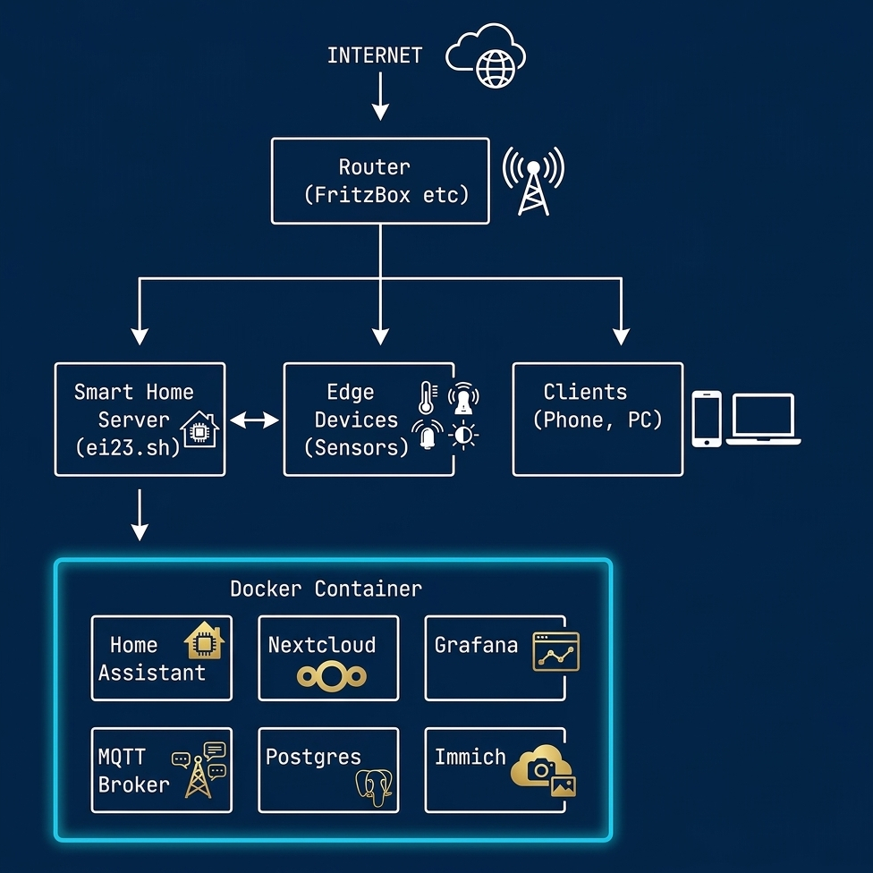

# Hardware-Struktur

Diese Seite erklärt die typische Hardware-Struktur eines ei23 Smart Home Servers und welche Komponenten du benötigst.

## Grundstruktur



Die typische Struktur eines ei23 Smart Home Systems mit Router, Server, Edge Devices und Clients.

## Komponenten

### 1. Smart Home Server (Zentrale)

Der [Server](server.md) ist das Herzstück deines Smart Homes:

| Aufgabe | Software |
|---------|----------|
| Zentrale Steuerung | Home Assistant, ioBroker, OpenHAB |
| Automatisierung | NodeRED, n8n |
| Datenbank | InfluxDB, PostgreSQL |
| Visualisierung | Grafana |
| Passwort-Safe | Vaultwarden |
| Cloud-Speicher | Nextcloud |

!!!tip "Hardware-Wahl"
    Siehe [Server / Mini-PC Hardware](server.md) für detaillierte Empfehlungen.

### 2. Edge Devices (Sensoren / Aktoren)

[Edge Devices](edge-devices.md) sind Geräte, die mit deiner Umgebung interagieren:

| Typ | Beispiele | Protokoll |
|-----|-----------|-----------|
| **Temperatur** | DHT22, BME280, Shelly | WLAN, Zigbee, ESPHome |
| **Licht** | Philips Hue, IKEA | Zigbee |
| **Schalter** | Shelly, Sonoff | WLAN, Zigbee |
| **Kameras** | Reolink, TP-Link | RTSP, ONVIF |
| **433MHz** | Wetterstationen | RTL-SDR |
| **Präsenz** | Aqara, LD2410 | Zigbee, ESPHome |

### 3. Netzwerk

Das Netzwerk verbindet alles:

```
Router (DHCP, DNS)
    │
    ├── WLAN (Sensoren, Telefone)
    │
    ├── LAN (Server, PCs)
    │
    └── Zigbee (separates Funknetz)
            │
            └── Zigbee2MQTT / ConBee
```

## Kommunikationswege

### MQTT (Message Queue Telemetry Transport)

MQTT ist das Standard-Protokoll für Smart Home:

```
Sensoren ──► MQTT Broker (Mosquitto) ──► Home Assistant
                     │
                     ├──► NodeRED
                     │
                     └──► Grafana / InfluxDB
```

### Zigbee

Für batteriebetriebene Geräte:

```
Zigbee-Stick ──► Zigbee2MQTT ──► MQTT Broker ──► Home Assistant
      │
      ├──► Bewegungsmelder
      ├──► Türkontakte
      └──► Temperatursensoren
```

### WLAN

Für stromversorgte Geräte:

```
WLAN-Geräte ──► Router ──► Home Assistant (Shelly, Sonoff, etc.)
```

### 433MHz (RTL-SDR)

Für günstige Sensoren:

```
RTL-SDR Stick ──► rtl_433 ──► MQTT ──► Home Assistant
      │
      ├──► Wetterstationen
      └──► Türkontakte
```

## Typische Setups

### Minimal-Setup (Einsteiger)

- **Server:** Raspberry Pi 4 (4GB) - ~70€
- **Sensoren:** 2-3 Shelly WLAN - ~30€
- **Gesamt:** ~100€

```
Raspberry Pi 4
    │
    └── WLAN
        ├── Shelly 1 (Lichtschalter)
        ├── Shelly Plus H&T (Temperatur)
        └── Shelly Plus Plug S (Steckdose)
```

### Standard-Setup (Empfohlen)

- **Server:** Intel N100 Mini-PC - ~150€
- **Zigbee-Stick:** Sonoff Zigbee 3.0 - ~10€
- **Sensoren:** 10-20 Zigbee-Geräte - ~100€
- **Gesamt:** ~260€

```
Intel N100 Mini-PC
    │
    ├── Zigbee Stick
    │   ├── 10x Temperatursensoren
    │   ├── 5x Türkontakte
    │   ├── 3x Bewegungsmelder
    │   └── 10x IKEA/Philips Lampen
    │
    └── WLAN
        ├── Kameras
        └── Shelly Schalter
```

### Erweitertes Setup

- **Server:** i5 Mini-PC mit GPU - ~400€
- **Edge Devices:** 50+ Geräte - ~300€
- **Media:** Jellyfin mit Hardware-Transkodierung
- **KI:** Lokale LLMs mit Ollama/llama-swap
- **Überwachung:** Frigate mit 4+ Kameras

## Sicherheitsarchitektur

```
Internet
    │
    ▼
┌──────────────┐
│  Firewall    │ (Router)
└──────┬───────┘
       │
       ▼
┌──────────────┐
│Reverse Proxy │ (Traefik/Nginx)
│  mit SSL     │
└──────┬───────┘
       │
       ▼
┌──────────────┐
│  Docker      │
│  Netzwerk    │
└──────────────┘
```

!!!warning "Sicherheit"
    - Nutze immer HTTPS mit [Traefik](../software/traefik.md) oder [Nginx Proxy Manager](../software/nginxproxy.md)
    - Öffne nur notwendige Ports am Router
    - Nutze [WireGuard VPN](../software/wireguard.md) für Remote-Zugriff
    - Starke Passwörter überall!

## Weitere Informationen

- [Server / Mini-PC Hardware](server.md)
- [Edge Devices](edge-devices.md)
- [Programme installieren](../start/docker-compose.md)
